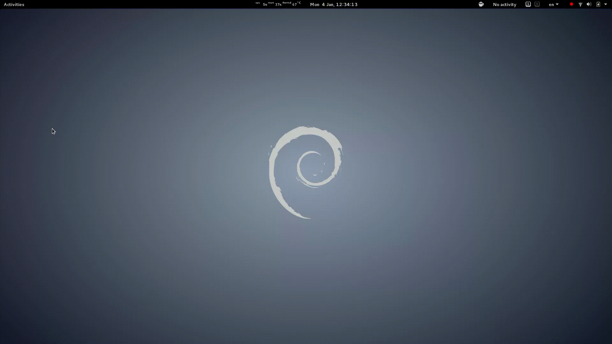

# DirchevScriptRunner

I had no Internet for 4 days and this is what happened.



# TODO

* remove not needed dependencies (npm and bower ones)

#Install
---

Install dependencies.

```
	npm install
```

Install bower dependencies

```
	bower install
```

#Run
---

Running can be done with gulp

```
	gulp run
```

Or with the `launch.sh` (be sure to make it executable)

```
	./launch.sh
```

#Release
---

Coming soon

#How I use it?

In `config.json` you can specify a path to a folder of `*.sh` files.

Currently the `example_scripts` is loaded. There are some of the scripts I am using.

I bind `launch.sh` to a shortcut, so I can easily access/execute my scripts.

Quick script runner is done :)
